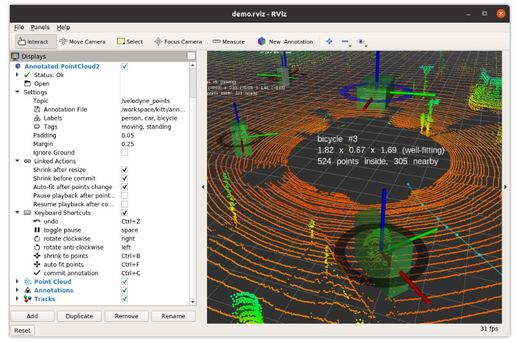

## maxieye-test


## 具体功能
1. 正确加载pcd文件; => done 页面挂载时加载
2. 可以标记点云，立体框，卡车(red),小汽车(Yellow); => 
3. 
4. 导出json并且下载，坐标，长宽高，标签；


ToDo：
1. 找泽颖要题目；
2. 找杨嘉靖问问是不是这样的坐标和大小
3. 改善功能
> 3.1 可以点击选择编辑哪一个；
> 3.2 完善json文件
> 3.3 完善readme

## 如何运行
```shell
yarn start
```
如报错，可参考node版本: v16.1.0

## 参考文档
[变换控制器](https://threejs.org/docs/?q=TransformControls#examples/zh/controls/TransformControls);
[变换控制器-示例](https://threejs.org/examples/#misc_controls_transform)



